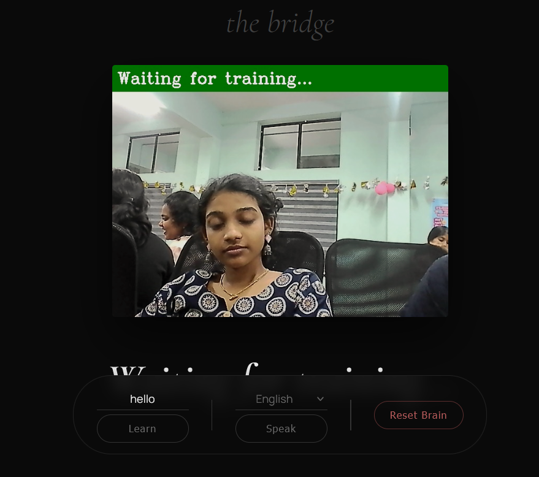
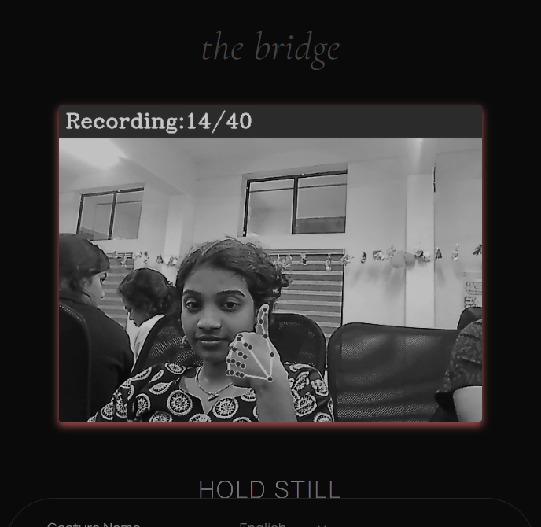
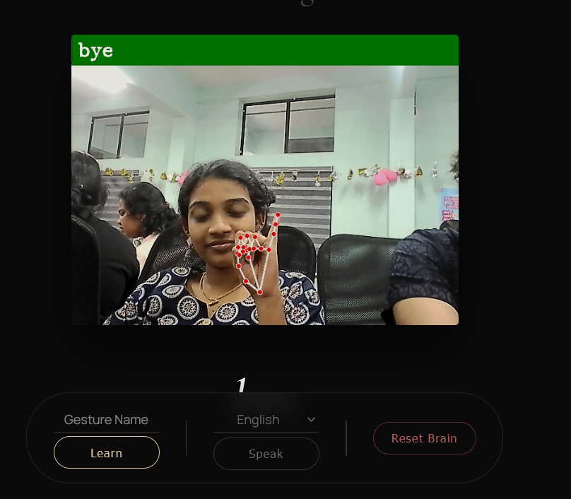
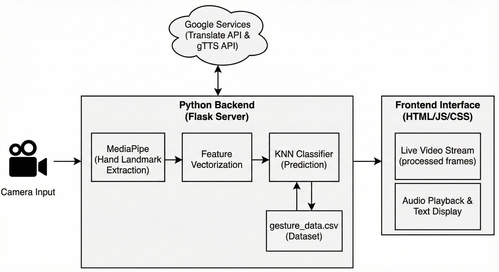
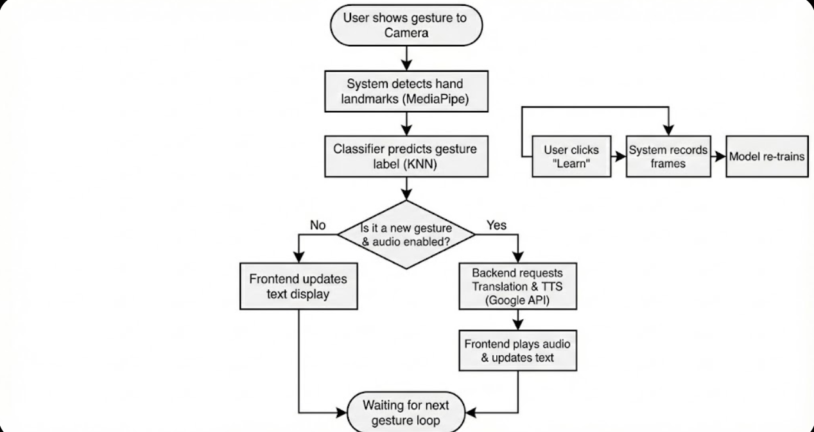

<p align="center">
  
</p>

# HELPING BRIDGE !! 🎯

## Basic Details

### Team Name: KRISHNAPRIYA's TEAM

### Team Members
- Member 1: Krishna Priya U P - College of Engineering and Management Punnapra

### Hosted Project Link
Can't host since a cmd project

### Project Description
A app that can train sign gestures and translate into text and audio

### The Problem statement
Helping mute people to live a normal life

### The Solution
Using KNN to train gestures and associated text and display text, audio when the gesture is recognized
---

## Technical Details

### Technologies
- Languages used: python,HTML/CSS,JS
- Frameworks used: flask
- Libraries used: mediapipe,tensorflow,gtts
- Tools used: VS code ,Git

---

## Features

List the key features of your project:
**Real-Time Gesture Recognition**: Uses MediaPipe and OpenCV to track hand landmarks with high precision and low latency.
- **Custom Gesture Training**: Users can teach the system new signs instantly by recording gestures directly through the web interface.
- **Multilingual Support**: Translates recognized gestures into English, Hindi, Malayalam, Tamil, and Telugu using Google Translate.
- **Text-to-Speech (TTS)**: Converts the translated text into audible speech using gTTS, enabling two-way communication.
- **Interactive Web Interface**: A beautiful, responsive "The Bridge" themed UI that works in modern browsers with visual feedback for recording and recognition.

---

## Implementation

#### Installation
```bash
# Clone the repository
git clone [https://github.com/yourusername/the-bridge.git](https://github.com/yourusername/the-bridge.git)
cd the-bridge
```
```bash
# Install dependencies
pip install -r requirements.txt
````

#### Run
```bash
python app.py
```

---

## Project Documentation

#### Screenshots (Add at least 3)

Home screen

Training

End result

#### Diagrams!


**System Architecture:**



**Application Workflow:**


*Add caption explaining your workflow*

---

### For Scripts/CLI Tools:

#### Command Reference

Command Reference

Basic Usage:
This project is primarily a Web Application. The main entry point is app.py.
Bash

python app.py

API Endpoints (Internal):

    /video_feed - Streams the processed video frames with landmarks.

    /get_status - Returns JSON with current prediction and recording status.

    /add_gesture - POST request to start training a new label.

    /process_audio - POST request to trigger translation and TTS.

    /reset_model - POST request to clear all learned gestures.

Troubleshooting Commands:
If you encounter dependency issues (e.g., Protocol Buffers), run:
Bash

# Force reinstall compatible versions
pip install --force-reinstall mediapipe==0.10.9 protobuf==3.20.3

Demo Output

Example: Server Startup

Command:
Bash

python app.py

Output:

 * Serving Flask app 'app'
 * Debug mode: on
WARNING: This is a development server. Do not use it in a production deployment.
 * Running on [http://127.0.0.1:5000](http://127.0.0.1:5000)
Press CTRL+C to quit
 * Restarting with stat
 * Debugger is active!
 * Debugger PIN: 123-456-789

## Project Demo

### Video


Video Demonstrates how to use the software, how to train and how it works after training
---

## Team Contributions

- Krishna priya U P:  All

---

## License

This project is licensed under the [MIT] License - see the [LICENSE](LICENSE) file for details.

---

Made with ❤️ at TinkerHub


